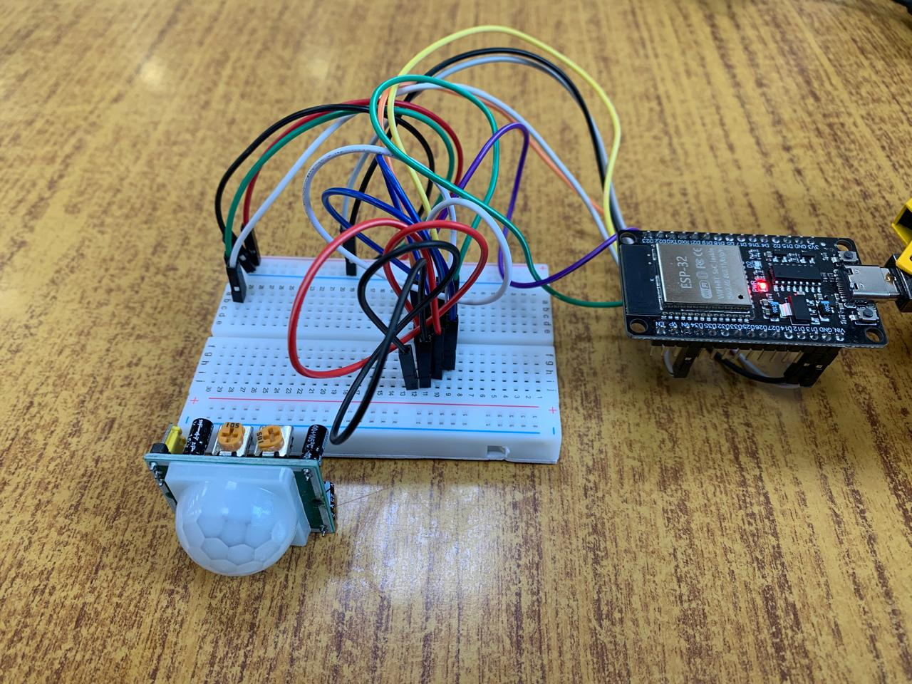
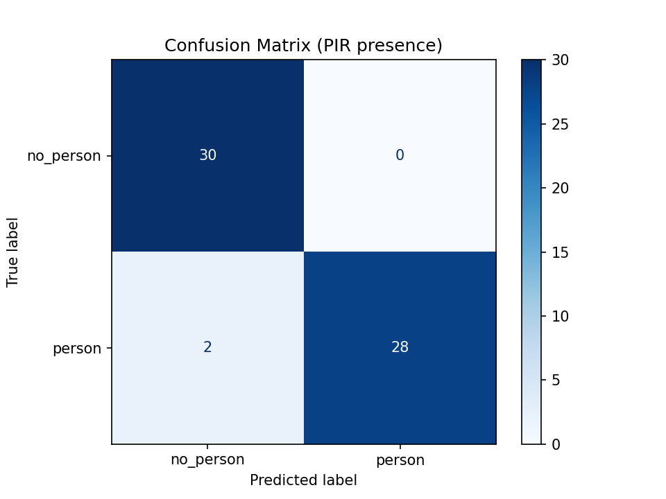
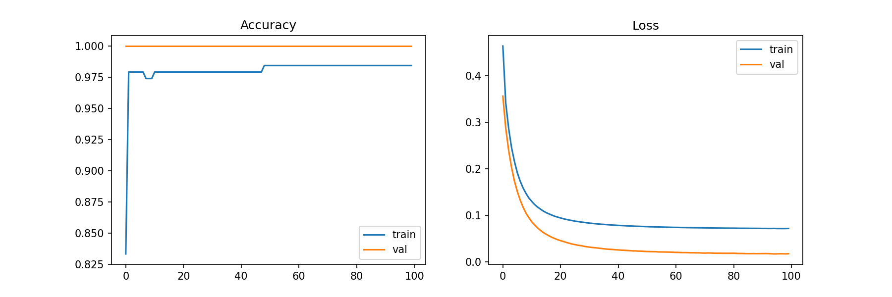
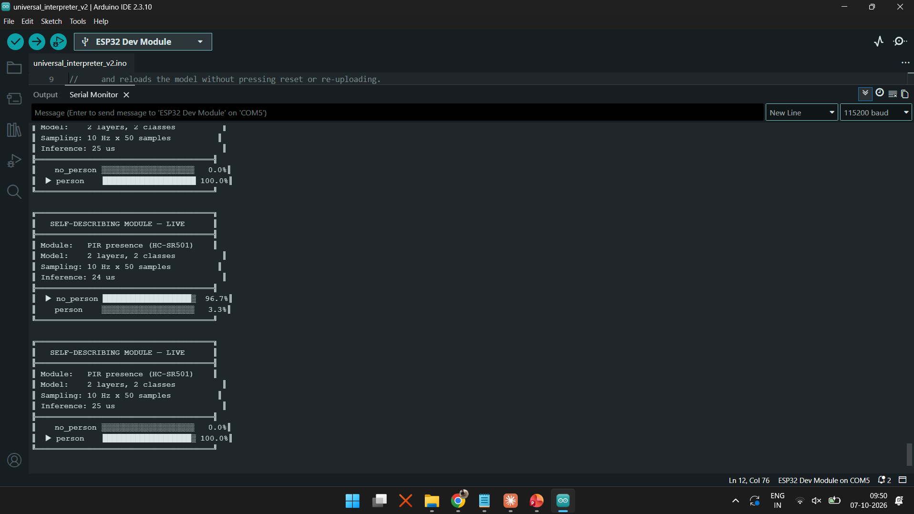

# TinyML Presence Detection on ESP32 (HC-SR501 PIR)

This repo is the second sensor module for the **Self-Describing Hot-Swappable TinyML Sensor Modules** project. It covers presence detection from an HC-SR501 PIR sensor: data collection, training, INT8 export and on-device inference on an ESP32, with a custom C++ engine and no external ML libraries.

Related repos:
- [tinyml-gesture-esp32](https://github.com/Hidi1208/tinyml-gesture-esp32): the MPU6050 gesture module
- [self-describing-tinyml-modules](https://github.com/Hidi1208/self-describing-tinyml-modules): the universal interpreter that loads either module's model from EEPROM at runtime



## Results

| Metric | Value |
|---|---|
| Classes | 2 (no_person, person) |
| Dataset | 300 windows (150 per class), 5 s each at 10 Hz |
| Test accuracy (float model) | 96.7% (58/60) |
| Test accuracy (INT8 weights) | 96.7% |
| TFLite int8 test accuracy | 96.7% |
| Rule baseline (any HIGH sample → person) | 96.7% |
| Parameters | 102 |
| Weight blob (INT8 W + float32 bias) | 108 bytes |
| TFLite int8 model size | 2,672 bytes |
| Inference time on ESP32 (standalone sketch) | ~16 µs (55 µs first call) |
| Inference time in universal interpreter (float32 weights from EEPROM) | 22–25 µs |

The model is deliberately minimal (Flatten → Dense(2) → Softmax). Its job is to show the system handling a second, **digital** sensor type, not to beat a threshold rule. It matches the rule baseline, as expected for a binary sensor. The remaining errors are windows where the PIR produced no trigger at all because the person was stationary. A PIR detects motion, not static presence.

| Confusion matrix | Training curves |
|---|---|
|  |  |



## System Architecture

```
┌─────────────────────────────────────────────┐
│                PC (Python)                  │
│                                             │
│  HC-SR501 → ESP32 → Serial → collect_data.py│
│                           │                 │
│                     pir_data.csv            │
│                           │                 │
│                    train_model.py           │
│               (Flatten → Dense → Softmax)   │
│                           │                 │
│      convert_model.py        export_engine.py
│      (TFLite int8 ref)   (INT8 weights, .h, │
│                           .bin, meta.json)  │
└───────────────────────────┬─────────────────┘
                            │
         ┌──────────────────┴──────────────────┐
         ▼                                     ▼
 inference/inference.ino           make_pir_image.py (SDHM repo)
 (weights compiled in)             → 24LC512 EEPROM on the module
                                   → universal interpreter loads it
```

## Hardware

| Component | Purpose |
|---|---|
| ESP32 DevKit v1 | Main MCU |
| HC-SR501 | PIR motion sensor (digital output) |
| 24LC512 | 64 KB I²C EEPROM holding the module's descriptor + weights |

### Wiring

| HC-SR501 | ESP32 |
|---|---|
| VCC | VIN (5 V) |
| OUT | GPIO 34 |
| GND | GND |

| 24LC512 pin | ESP32 |
|---|---|
| 1, 2, 3, 4, 7 (A0, A1, A2, VSS, WP) | GND |
| 5 (SDA) | GPIO 21 |
| 6 (SCL) | GPIO 22 |
| 8 (VCC) | 3.3 V |

HC-SR501 settings: jumper on **H** (repeatable trigger), time-delay pot fully anticlockwise (~3 s), sensitivity pot at mid. It needs about 60 s to warm up after power-on.

The I²C bus runs at 100 kHz using the ESP32's internal pull-ups. See [WIRING.md](WIRING.md) for details.

## Software Stack

- Python 3.11, TensorFlow 2.x, scikit-learn, NumPy, pandas, pyserial
- Arduino IDE 2.x, ESP32 Arduino core

## Reproduction

### 1. Install dependencies

```bash
pip install tensorflow pandas numpy scikit-learn matplotlib pyserial
```

### 2. Collect data

Flash `data_collection/data_collection.ino` to the ESP32 and close the Serial Monitor. Then:

```bash
python collect_data.py      # set PORT inside the file first
python check.py
```

### 3. Train, quantize, export

```bash
python train_model.py
python convert_model.py
python export_engine.py
```

### 4. Run on the ESP32

Flash `inference/inference.ino`. `pir_inference_engine.h` is generated into that folder by step 3. Open the Serial Monitor at 115200.

### 5. EEPROM wiring check (optional)

Flash `eeprom_test/eeprom_test.ino`. It should report `device at 0x50` and `PASS`.

## Data Format

- Window: 50 samples at 10 Hz = 5 s, 1 channel (PIR OUT, 0/1)
- CSV columns: `s0 … s49, label` (0 = no_person, 1 = person)
- No normalization: raw 0/1 samples go straight into the model

## Weight Format

```
pir_weights.bin  (108 bytes)
  [0   .. 99 ]  int8    Dense W[50][2], row-major
  [100 .. 107]  float32 Dense bias[2], little-endian
pir_model_meta.json     layer list, shapes, weight scale, labels
```

Engine maths: `out[o] = b[o] + scale · Σ x[i] · w_q[i][o]`, then softmax.

## License

MIT
